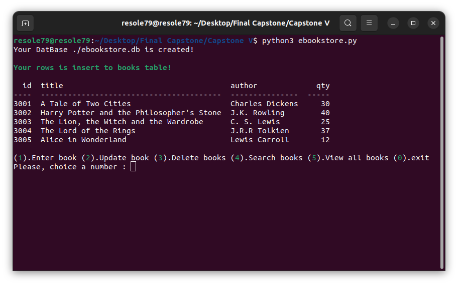
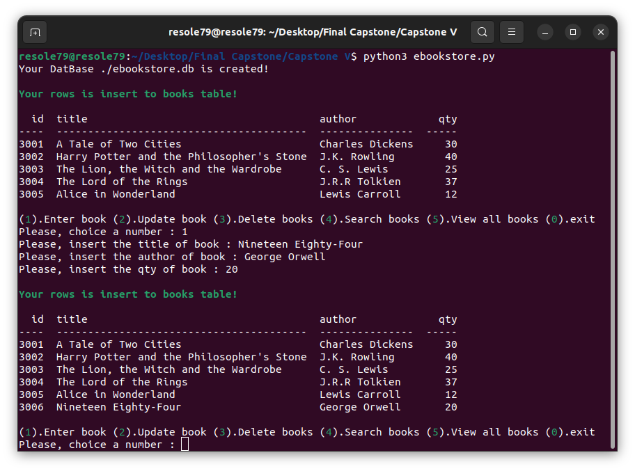
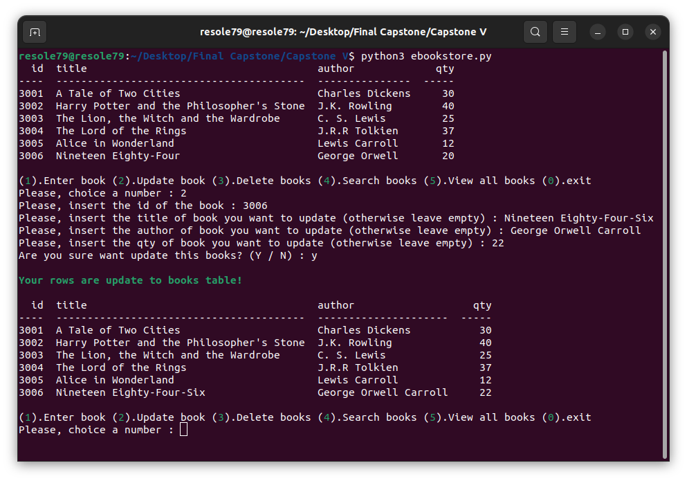
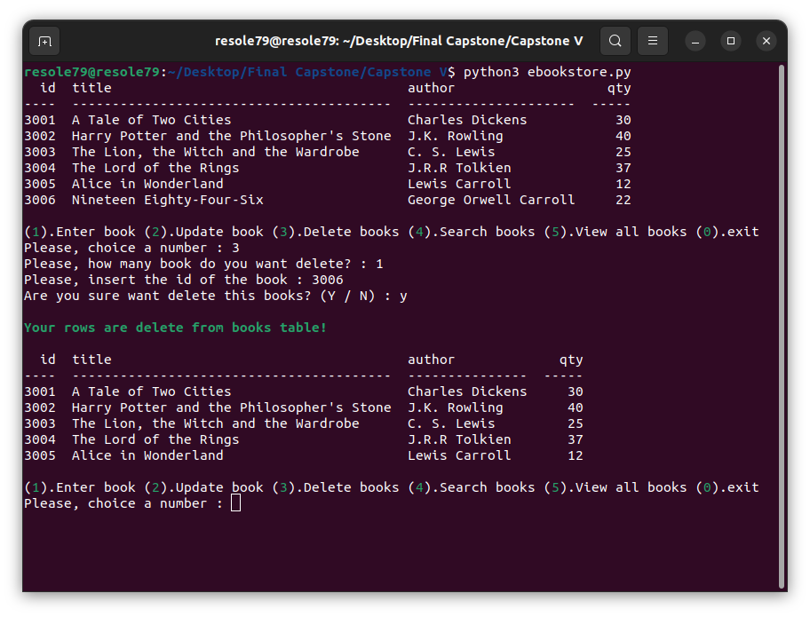
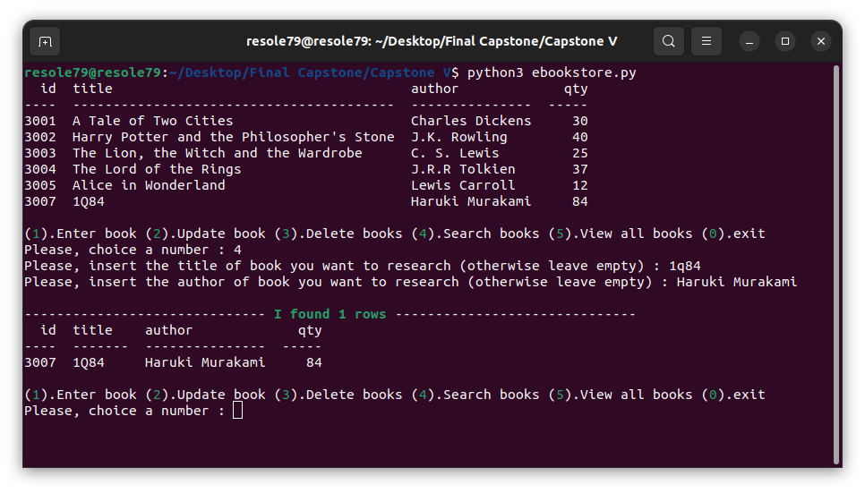

## Ebook Store 

Program that can be used by a bookstore clerk.     
The program will add, update, delete and search books from the database sqlite call ebookstore

#### Prerequisites
You will need the following software to run the Ebook Store :
 - [Python 3](https://www.python.org/downloads/)
 - [Sqlite 3](https://www.sqlite.org/index.html)
 - [tabulate](https://pypi.org/project/tabulate/)

#### Installation
To get started with the Ebook Store , follow these steps:

1. **Install** tabulate
```sh
pip install tabulate
```

2. **Clone** the repository:

```sh
git clone https://github.com/resole79/ebookstore.git
```

3. **Run** the **ebookstore.py** file:

```sh
python3 ebookstore.py
```

#### File Structure   
 - **ebookstore.py**: Main program.


#### **Usage**

**How program present**

<p align="center"><br><i>menu</i></p>

**User selects *‘1’* to insert a book**

Ask the user to input:
 - The title of book
 - The author of book
 - The quantity of book

<p align="center"><br><i>user selects “1”</i></p>


**User selects *‘2’* to update a book**

Ask the user to input:
 - The id of the book
 - The title of book
 - The author of book     

 You can leave empty if don't want any change.
 The program asks you also if you are sure you want to update the item.

<p align="center"><br><i>user selects “2”</i></p>


**User selects *‘3’* to delete a book**

Ask the user to input:
 - The quantity of book you want to delete
 - The id of the book  

 The program asks you also if you are sure you want to delete the item.

<p align="center"><br><i>user selects “3”</i></p>


**User selects *‘4’* to search a book**

Ask the user to input:
 - The title of book
 - The author of book     

 You can leave empty if don't want any search.

<p align="center"><br><i>user selects “4”</i></p>


## **Credit**

Author : Emilio Reforgiato (resole79)

##
<p align="right"><a href="https://www.linkedin.com/in/emilio-reforgiato/" target=”_blank” ></a></p>

